# Predicting Pokémon: A use case for creative classification and ideation with machine learning

* Phase 1: Gotta classify them all
* Phase 2: Gotta generate them all

### Data Sourcing Content

Data was sourced from Kaggle and can be found here: https://www.kaggle.com/vishalsubbiah/Pokémon-images-and-types

Dataset contains all Pokémon from Generation 1 to 7, and consists of 809 unique images.

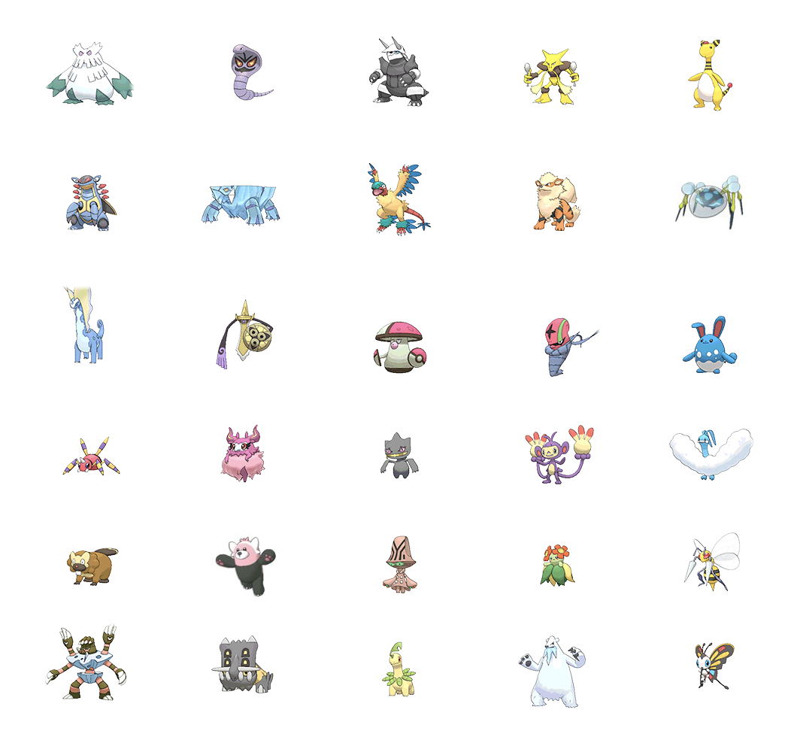

### Business Case

Design and innovation firms are asked to come up with mock ups and pitches in a fast moving environment.  They also require in-house or freelance resources that are taken away from current paying work. 

This produces 2 questions:

* Can classifying evolved Pokémon be used to as a proof of concept for design consistency?
* Can generating Pokémon be used as a proof of concept for rapid ideation and character prototyping?

### Data Cleaning/Visualization

Datasets were built by hand - sorting evolved and not evolved into two separate folders.

Images were reproduced 7 times in order to create the training data resulting in a final total of 3120 EVOLVED Pokémon and 3369 NOT_EVOLVED Pokémon

As a result of this approach, the low class imbalance was retained:

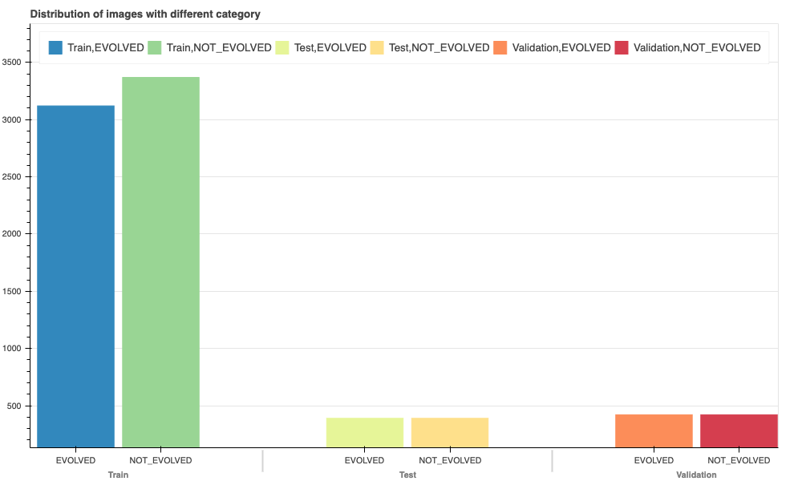

If using a Dummy Classifier, the dominant class will be predicted 52% of the time.

Images were converted from PNG to JPG to remove the transparency layer and make the images viable for the models:

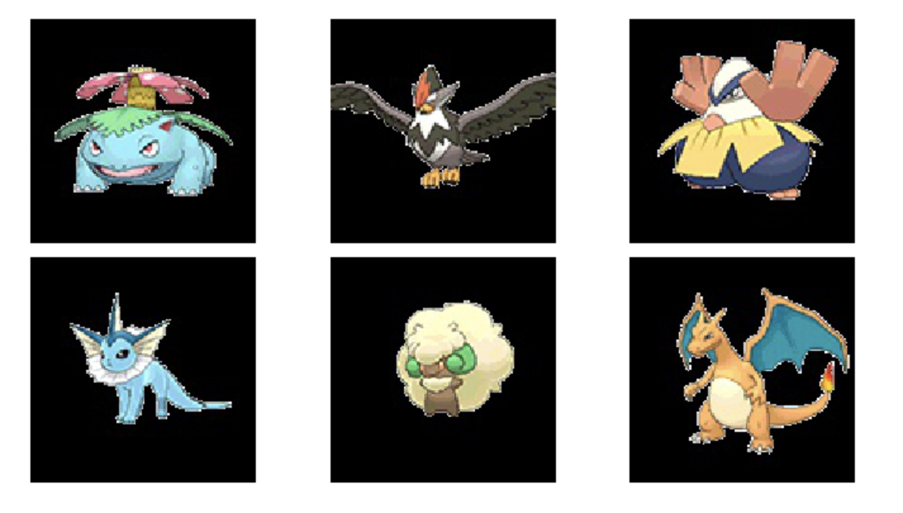

All images are uniform in size: 120x120

## Phase 1: Classifying whether a given Pokémon has evolved using a Convolutional Neural Network

## Models:

### Base CNN Model

Model: "sequential"

### Summary:

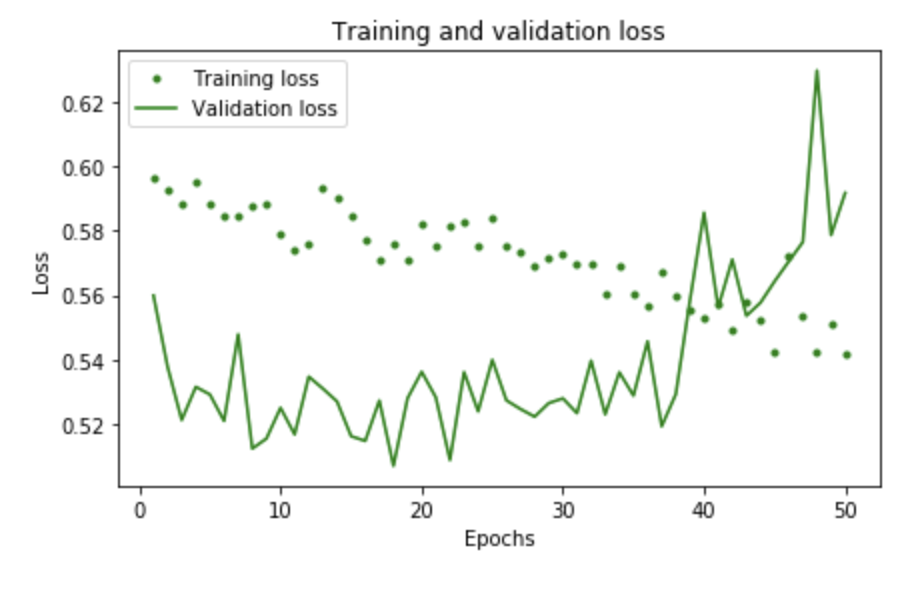

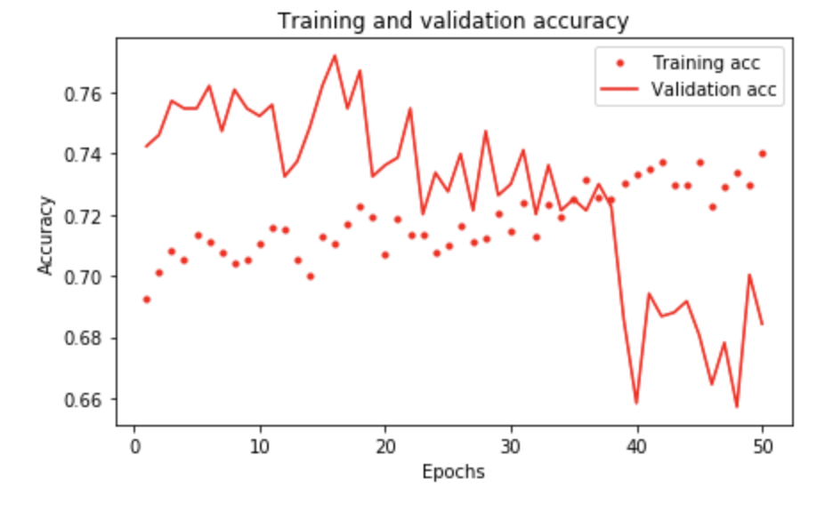

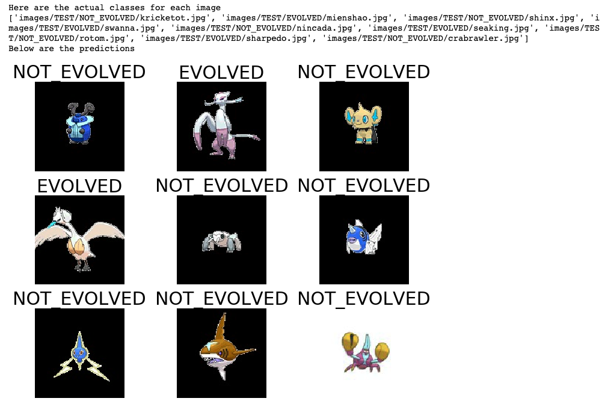

#### Accuracy: 74%
#### Loss: 0.5407

* Optimizer: Adam
* Learning Rate: 0.001
* Steps per epoch: 300

#### Better than the baseline metric (52%)

## Transfer Learning with VGG16

Context: VGG16 is a convolutional neural network model proposed by K. Simonyan and A. Zisserman from the University of Oxford in the paper “Very Deep Convolutional Networks for Large-Scale Image Recognition”.

Model: "model_3"

### Summary:

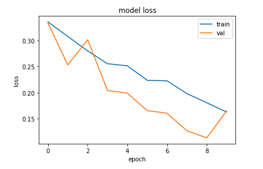

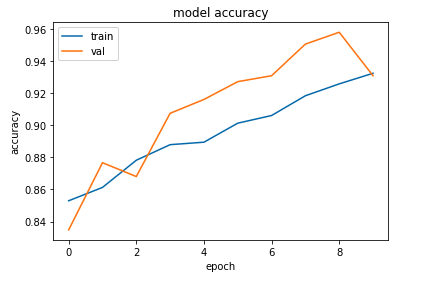

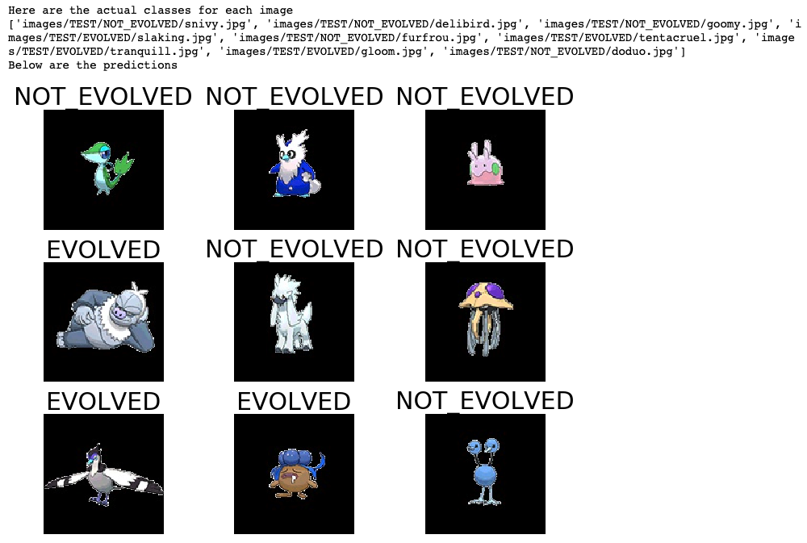

#### Accuracy: 93%
#### Loss: 0.1650

* Optimizer: Adam
* Learning Rate: 0.0001
* Steps per epoch: 300

#### Significantly better than the baseline metric (52%)

### Phase 1 Conclusion

The VGG16 model worked significantly better than the baseline model.  This means that the data used to train the model is viable for using in a GAN to produce novel Pokémon in Phase 2 of the project.

## Phase 2: Creation of a GAN using the same dataset with a goal of producing novel Pokémon

### Model - DCGAN

In order to accomplish building a GAN:

* I created a DCGAN that was built using the tutorial written by Jeff Heaton
* Deep Convolutional Generative Adversarial Networks are similar to a CNN in that they work with images and use layers
* The difference here is that the two models are adversaries, much like a Pokémon arena
* The Generator (Ash) will create new Pokémon in an attempt to “fool” the Discriminator
* The Discriminator (Battle Judge) will then “judge” the images it receives and determine if they are, in fact, Pokémon
* Dataset: 809 Pokémon

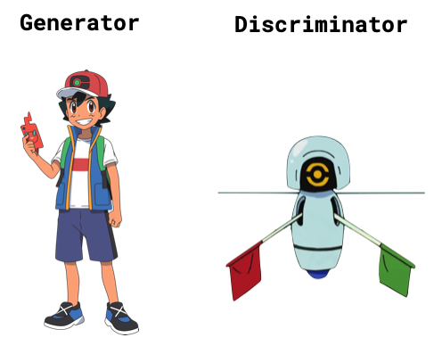

* All models were trained with mini-batch stochastic gradient descent (SGD) with a mini-batch size of 128.
* All weights were initialized from a zero-centered Normal distribution with standard deviation 0.02.
* The Generator uses ReLu activations as well as tanh for the final layer
* The Discriminator uses lRelu (leaky Relu) for all activation layers
* To implement, I used 3 different notebooks - 2 on Google Colab and 1 on Paperspace Gradient

### Results

* So it turns out building a stable DCGAN is really challenging
* I managed to generate Pokémon-esque blobs of pixels

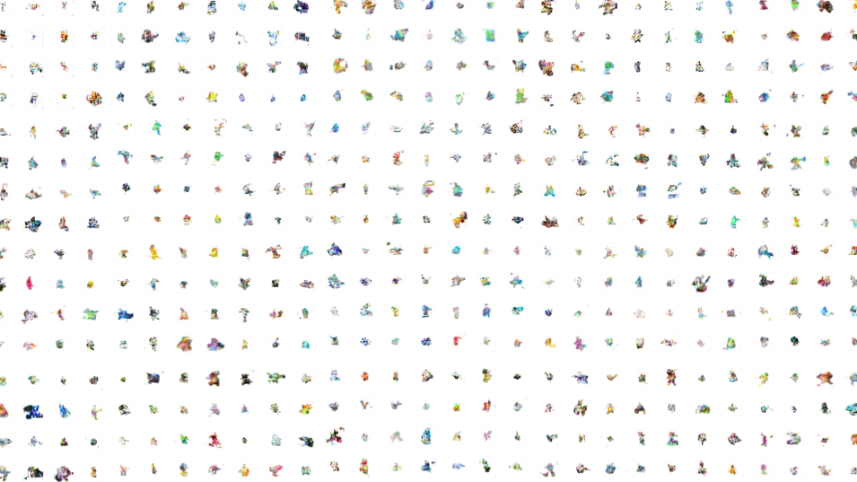

* Performance of the model was relatively static in that my generator loss and discriminator loss maintained the same scores throughout
* 52,000 epochs
* gen_loss=0.6922744512557983, disc_loss=1.007383942604065, 0:00:00.63

### Limitations included

* Cloud computing is complex to set up
* Free GPU’s are great until they aren’t
* Limited understanding of how to further tune hyperparameters
* Stable, High-Res GAN’s are TOUGH

### Next Steps:

* LEARN LEARN LEARN
* Successfully set up project to run with Google Cloud TPU’s
* Generate actual Pokémon
* Take generated Pokémon and run them through the CNN to see how they would be classified
* Tell everyone I’ve ever met that I did it

### Link to presentation

* Phase 1 and 2:

https://github.com/thomaspatrickhill/Mod_5_Project/blob/master/Phase%201%20and%202%20Presentation.pdf

* Phase 1:

https://github.com/thomaspatrickhill/Mod_5_Project/blob/master/photon%20presentation%20-%20mod%205.pdf

### Sources

* https://pokemondb.net/evolution
* https://medium.com/@shikharsrivastava_14544/face-recognition-using-transfer-learning-with-vgg16-3caeca4a916e
* https://www.freecodecamp.org/news/how-to-build-an-image-type-convertor-in-six-lines-of-python-d63c3c33d1db/
* https://github.com/jeffheaton/t81_558_deep_learning/blob/master/t81_558_class_07_2_Keras_gan.ipynb

